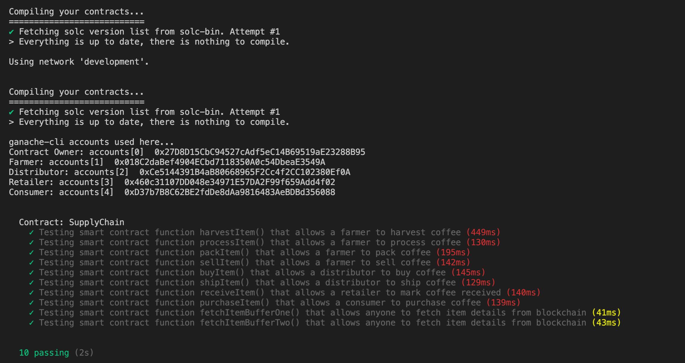
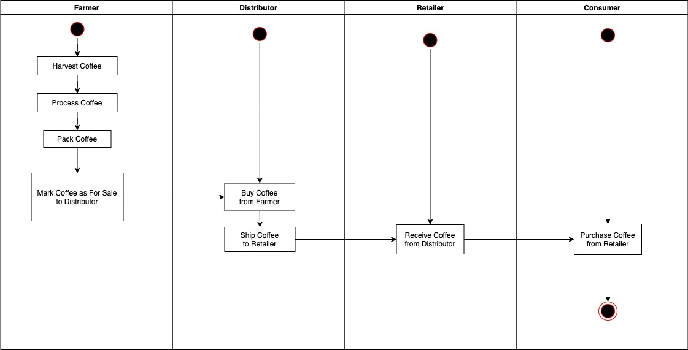
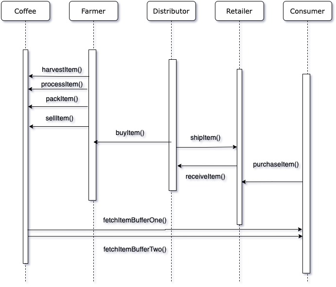
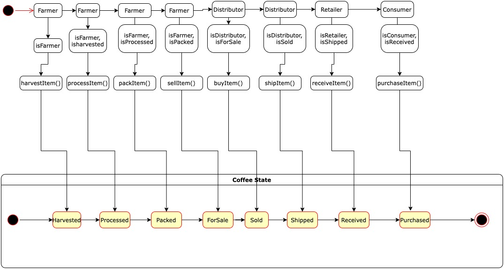
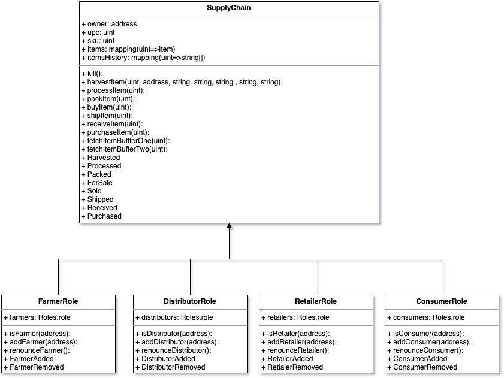

# Ethereum Dapp for Tracking Items through Supply Chain

## General Write-Up

### Contract Address on Rinkeby Testnet
`0x5Fd8fcb7bC6dF37E3C79DD7697c926Ce96aEEB19` 

### Transaction Hash on Rinkeby Testnet
`0x694338b99a0dde8b87e83de8435d90a59af390e0485814f1d326339622661057`





### UML Diagrams

#### 1. Activity Diagram


#### 2. Sequence Diagram


#### 3. State Diagram


#### 4. Data Model Diagram



### Libraries Write-up
To deploy to the Rinkeby Testnet using my Infura key and Metamask accounts, I used the Web3 and Truffle Hardware Wallet libraries.
#### Dependencies
````
lite-server@2.6.1
truffle-hdwallet-provider@1.0.6
web3@1.6.0
````

### IPFS Write-up
IPFS was not used in this project